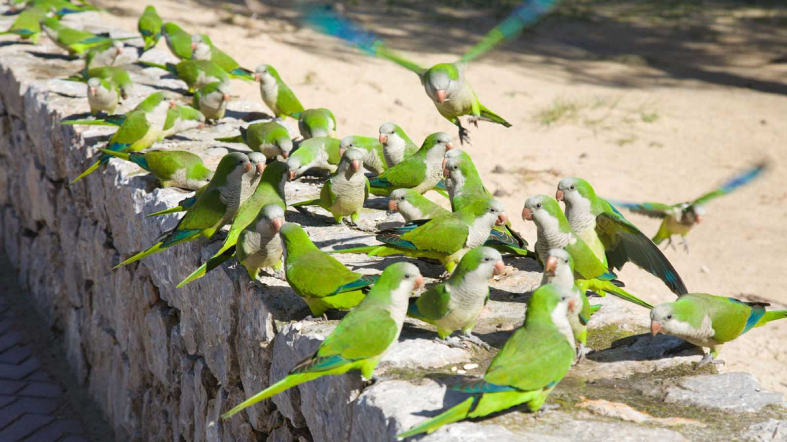
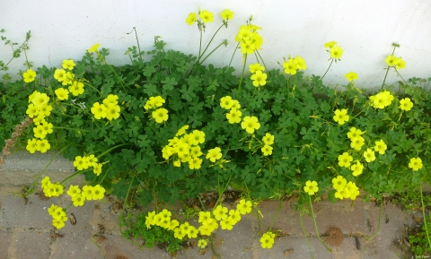

```{r setup, include=FALSE}
knitr::opts_chunk$set(echo = TRUE)
```

# Introducción

Las **especies exóticas invasoras** (EEI) son aquellas que se introducen
en un ecosistema por el ser humano. La mayoría de estas EEI son animales
o plantas. Algunas de ellas son:

{width="480"}

Cotorra argentina *Myiopsitta monachus*



Vinagrera *Oxalis pes-caprae*

## Información complementaria

Para más información, se recomienda consultar el anexo del [Real Decreto
630/2013](https://www.boe.es/eli/es/rd/2013/08/02/630/con), de 2 de
agosto, por el que se regula el Catálogo español de especies exóticas
invasoras.

## Datos sobre las especies exóticas invasoras
En cuanto a los grupos taxonómicos que actúan como EEI, estos son las proporciones:
```{r, echo=FALSE, message = FALSE}
library(readxl)
library(here)
data<-read_xls(here("EEI.xls"),sheet = 1)
pie(data$Total,labels = etiquetas_con_porcentajes,col = rainbow(n = 6,s = 0.4))
porcentajes <- round(100 * data$Total / sum(data$Total), 1)
etiquetas_con_porcentajes <- paste(data$Taxonomic_group, "\n", porcentajes, "%", sep = "")

# Mostrar las etiquetas con porcentajes en la gráfica
legend("topright", legend = data$`Taxonomic group`, cex = 0.8, fill = rainbow(n = 6, s = 0.4), bty = "n")
```
Y estos son los ambientes en los que habitan estas EEI:

```{r, echo=FALSE, message = FALSE}
library(readxl)
library(here)

data2<-read_xls(here("EEI.xls"),sheet = 3)

library(dplyr)
EEI_environment <- data2 %>%    #create a new data table of the aggregated data
  group_by(Environment) %>%    #group by environment 
  summarize(`num_env` = n())
EEI_environment <- EEI_environment[-5,] #Le quito los NA
pie(EEI_environment$num_env,labels = EEI_environment$`Environment`,col = rainbow(n = 4,s = 0.4))

```
